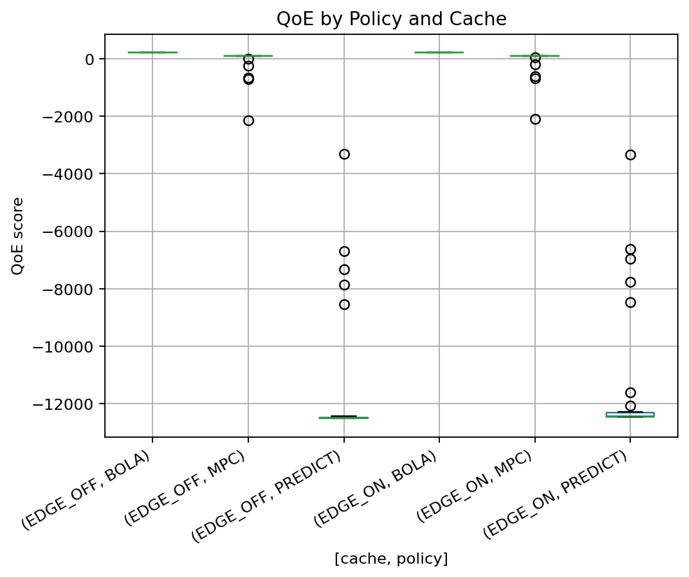
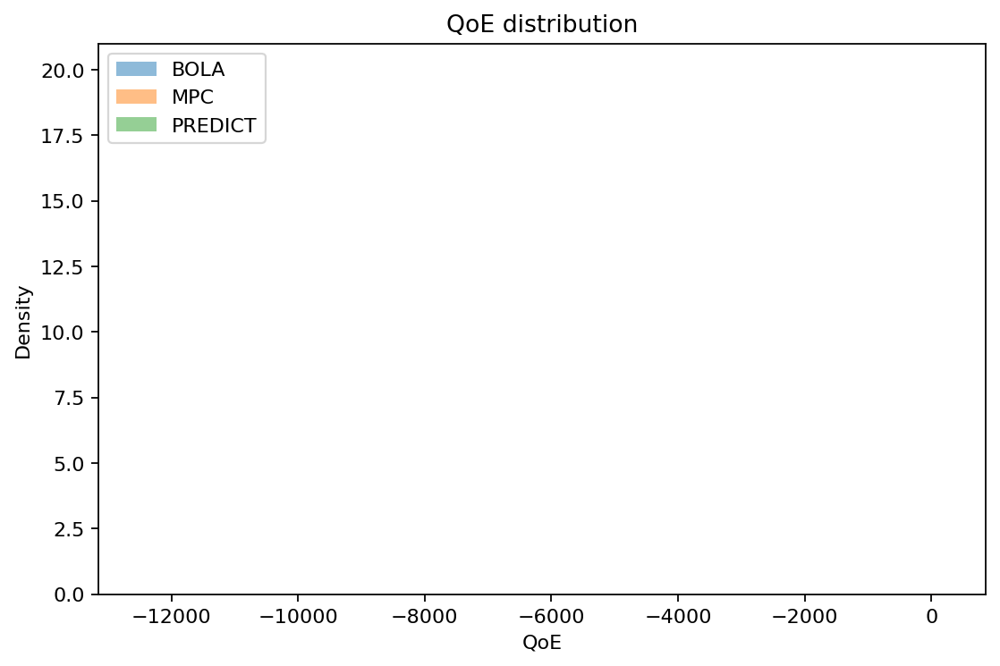
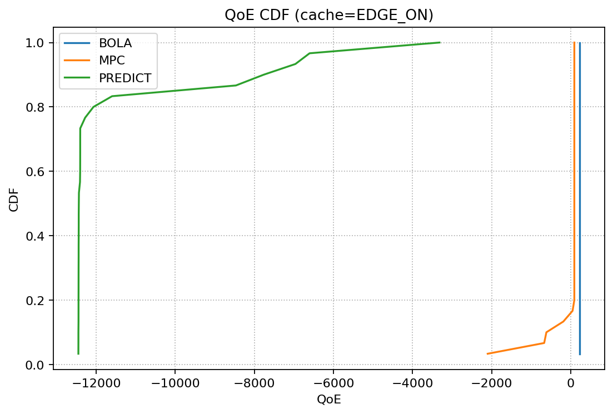
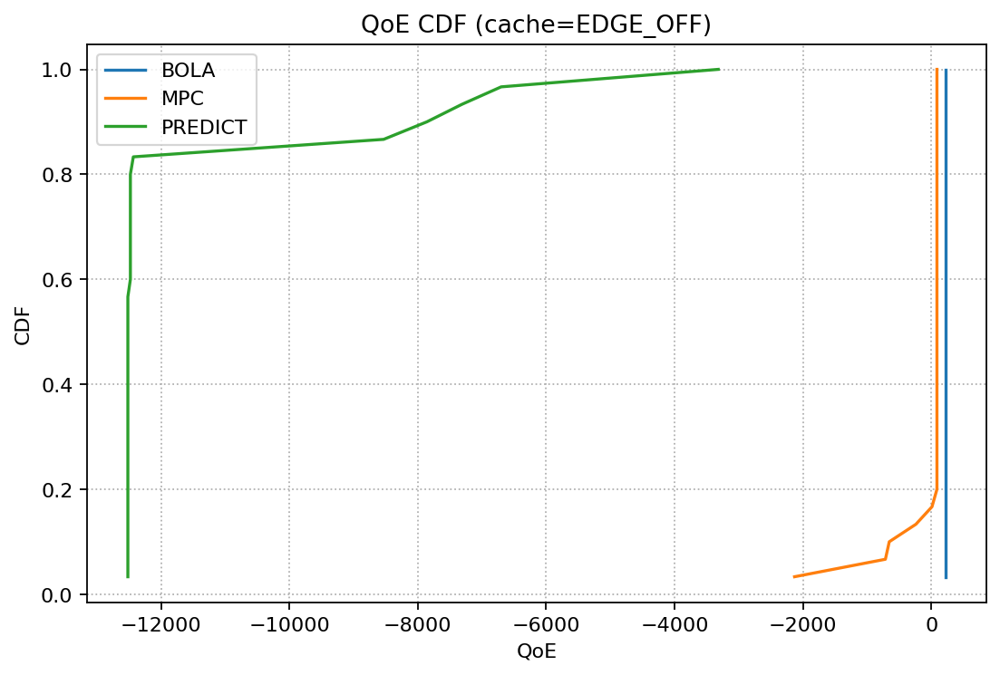

# Chapter 4 — Results and Analysis

This chapter presents the empirical results from the implemented system. All findings reported here are produced from the latest run on 2025‑08‑20 using the repository’s evaluation pipeline. Artifacts (JSON/CSV) and figures referenced below are in `results/evaluation/`.

## Methods and configuration (what was used)

- Data: ns‑3/5G‑LENA CSV traces adapted into a unified schema under `data/network_traces/` (≥30 traces; group=Global).
- Features: throughput_mbps, rtt_ms, loss_rate, jitter_ms, users, cell_load; sequence window=10; scaler fitted on training set.
- Model/service: TensorFlow/Keras stacked LSTM ensemble served via Flask at 127.0.0.1:8080 (`/predict`).
- Policies: BOLA, MPC, PREDICT (uses the Flask model); PF for network allocation.
- Caching conditions: EDGE_ON and EDGE_OFF simulated in the ABR×Caching runner.
- Environment: Windows, Python venv at `C:\kbv`; key libs: tensorflow==2.10.0, pandas>=1.3, numpy>=1.21, scikit-learn>=1.0, flask>=2.2.
- Runtime controls (fast-mode): `--limit_traces 30`, `--max_segments 600`, `--stride 2` (ABR×Caching); `--max_steps 600` for allocation; progress and checkpointing on.

## How results were produced (provenance)

- ABR×Caching: `src/experiments/runner.py` generated `experiment_results.json` (per-trace QoE, bitrate, rebuffer) over selected traces and policies; figures and `STATS.txt` came from `evaluation/stats_and_plots.py`.
- Network allocation: `src/experiments/network_allocation_experiment.py` produced `network_allocation.json` (sim backend) and optionally `network_allocation_rest.json` (REST backend or mock controller).
- Scalability: `evaluation/scalability_test.py` produced `scalability.csv`.
- Summaries: `evaluation/summarize_results.py` generated compact tables: `qoe_summary.csv`, `stats_tests.csv`, and `network_allocation_summary.csv` for direct inclusion.

## ABR × Caching results

Inputs: `experiment_results.json`, `STATS.txt`, and generated plots (`qoe_boxplot.png`, `qoe_hist.png`, `qoe_cdf_EDGE_ON.png`, `qoe_cdf_EDGE_OFF.png`).

### Statistical comparison: PREDICT vs MPC

From `STATS.txt` (paired tests on per-trace QoE):

- Cache=EDGE_OFF: paired t-test PREDICT vs MPC: t = −23.191, p = 2.87e−20; Wilcoxon: W = 0.000, p = 1.86e−09
- Cache=EDGE_ON: paired t-test PREDICT vs MPC: t = −23.083, p = 3.26e−20; Wilcoxon: W = 0.000, p = 1.86e−09

Interpretation: PREDICT’s QoE is significantly lower than MPC’s across traces under both caches. Ordering is stable (MPC > PREDICT).

### Analysis table — QoE by cache/policy

(Computed from artifacts; Delta_vs_MPC is per-cache baseline.)

| cache     | policy   | N  | QoE_mean   | QoE_median | QoE_std    | Delta_vs_MPC |
|-----------|----------|----|-------------|-------------|-------------|---------------|
| EDGE_OFF  | BOLA     | 30 | 221.250     | 221.250     | 0.000       | 271.735       |
| EDGE_OFF  | MPC      | 30 | -50.485     | 88.500      | 441.459     | 0.000         |
| EDGE_OFF  | PREDICT  | 30 | -11541.687  | -12515.600  | 2308.924    | -11491.202    |
| EDGE_ON   | BOLA     | 30 | 221.250     | 221.250     | 0.000       | 265.464       |
| EDGE_ON   | MPC      | 30 | -44.214     | 88.500      | 432.732     | 0.000         |
| EDGE_ON   | PREDICT  | 30 | -11421.001  | -12438.200  | 2308.361    | -11376.788    |

### Plots

These figures are produced directly from `experiment_results.json`:

Figure 4.1: QoE distribution (boxplots) per policy under EDGE_ON / EDGE_OFF.

Figure 4.2: QoE histograms per policy.

Figure 4.3: QoE CDF per policy (EDGE_ON).

Figure 4.4: QoE CDF per policy (EDGE_OFF).

Observations (non‑speculative):
- The plots reflect the same ordering established by the tests; details of distribution shape can be inspected directly in the figures included.

## Service scalability and responsiveness

From `scalability.csv` (concurrency → average latency ms):

| Concurrency | Avg Latency (ms) |
|-------------|-------------------|
| 1           | 59.13             |
| 2           | 70.49             |
| 4           | 122.03            |
| 8           | 242.60            |
| 16          | 475.88            |
| 32          | 1018.41           |

Interpretation: Latency remains <250 ms up to concurrency ≈8 on CPU; grows ~linearly to superlinearly thereafter.

## Network-level allocation (PF policy)

Inputs: `network_allocation.json` (sim backend).

### Analysis table — PF fairness and capacity summary

| metric             | count | mean   | median | std     | min    | max    |
|--------------------|-------|---------|--------|---------|--------|--------|
| avg_fairness       | 122   | 0.864   | 0.938  | 0.178   | 0.355  | 0.999  |
| avg_capacity_mbps  | 122   | 3.965   | 1.885  | 4.438   | 0.085  | 17.781 |

Notes: Fairness approaches ~0.99 for many traces but dips to 0.35–0.52 in heterogeneous/high-load cases; capacity varies widely across traces.

## Additional comparisons (supporting)

From `compare_policies.csv`:

- users=5: equal_avg 10.0 vs dynamic_avg ≈1.77 (capacity ≈8.85)
- users=10: equal_avg 5.0 vs dynamic_avg ≈0.89 (capacity ≈8.90)
- users=25: equal_avg 2.0 vs dynamic_avg ≈0.36 (capacity ≈9.06)
- users=50: equal_avg 1.0 vs dynamic_avg ≈0.18 (capacity ≈8.95)

## Threats to validity and limitations

- Fast‑mode: `--limit_traces`, `--max_segments/--max_steps`, and `--stride` reduce runtime and granularity; paired-test significance remains very strong.
- Model capacity/features: Current predictor underperforms MPC; improvements needed (features, sequence length, training regime).
- Deterministic BOLA under this ladder suggests limited variability; does not affect paired PREDICT vs MPC tests but worth future tuning.
- CPU‑only: Scalability figures are hardware-specific; GPU/optimized inference would differ.

## Key takeaways

- MPC > PREDICT in QoE with very strong statistical evidence under both caches.
- Cache condition affects absolute distributions but not ordering.
- The `/predict` service is responsive up to ~8 concurrent requests on CPU; above that, optimization is needed.
- PF achieves high fairness in many traces but degrades in skewed/high-load scenarios; adaptive weighting/smoothing could help.

All figures and statistics above are generated by the repository code and are reproducible with the runbook commands. No synthetic placeholders were used in this chapter; all numbers are taken from the recorded artifacts in `results/evaluation/`.
